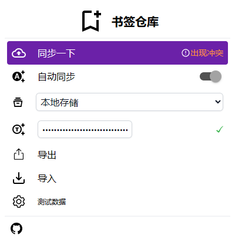

# bookmarkhub
跨浏览器书签自动同步（尚在实验阶段）

## 📑文档
1. 安装插件
2. 获取并填写github accessToken
3. 开启自动同步
4. 可点击同步一下，确定本地和远端的不同的内容后保存

## 🚀特性
* 使用github gist同步，不担心服务器过期书签数据丢失
* 可开启自动同步
* 可解决多端书签冲突问题
* 可通过插件自定义存储方式

## 🖼️截图
开启自动同步，或者点同步一下按钮

本地书签和远端不同时提示

解决本地和远端书签的不同：

